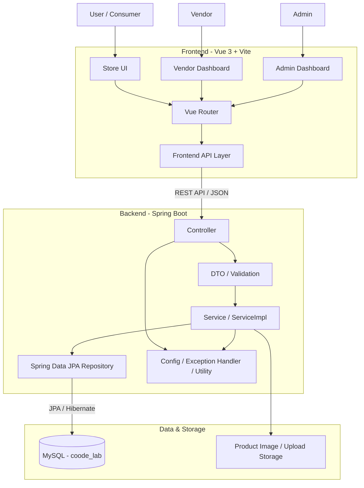

```{=html}
<p align="center">
```
``{=html}
```{=html}
</p>
```
# Coode_LAB

```{=html}
<p align="center">
```
`<strong>`{=html}多角色服飾電商 × 穿搭管理 ×
廠商營運平台`</strong>`{=html}`<br>`{=html} Vue 3 + Spring Boot + Spring
Data JPA + MySQL
```{=html}
</p>
```

------------------------------------------------------------------------

## 1. 專案簡介

**Coode_LAB** 是一套以服飾購物情境為核心的全端 Web
專案，整合一般會員商城、合作廠商後台與系統管理員後台。

系統除了基本商品瀏覽、會員、購物車與訂單流程，也包含商品規格與庫存、退換貨、穿搭組合、商品圖片、廠商銷售報表、低庫存管理與後台管理等模組。

目前專案採 Vue + Spring Boot 前後端分離方式開發：

``` text
Vue 3 / Vite
     ↓ REST API
Spring Boot
     ↓
Spring Data JPA / Hibernate
     ↓
MySQL
```

開發完成後亦可將 Vue Production Build 整合至 Spring Boot
`static`，再封裝成單一可執行 JAR。

------------------------------------------------------------------------

## 2. 專案目標

Coode_LAB 不只是一個單純的購物網站，而是希望建立一套同時涵蓋：

-   消費者購物體驗
-   會員與購物車管理
-   商品與規格管理
-   訂單與退換貨流程
-   廠商商品與庫存管理
-   廠商銷售分析
-   系統管理員管理
-   穿搭組合與未來智慧穿搭應用

的服飾電商管理平台。

------------------------------------------------------------------------

## 3. 系統角色

### User / Consumer

一般會員主要使用商城功能：

-   會員註冊、登入
-   忘記／重設密碼
-   修改會員資料與密碼
-   商品瀏覽、搜尋、篩選
-   商品詳情
-   商品顏色／尺寸 Variant
-   購物車
-   訂單
-   修改收件資訊
-   取消訂單
-   收貨
-   退換貨申請與查詢
-   穿搭組合與收藏
-   帳號管理

### Vendor

合作廠商使用 Vendor 後台：

-   廠商登入
-   廠商帳號資訊
-   商品新增／修改
-   商品上下架
-   Product Variant 管理
-   顏色／尺寸／庫存管理
-   補貨
-   低庫存管理
-   訂單處理
-   退換貨處理
-   銷售報表 Dashboard
-   商品銷售排行
-   營收、訂單數、銷售件數與退貨資料

### Admin

系統管理員負責平台管理：

-   管理員登入
-   管理員帳號管理
-   會員狀態管理
-   廠商建立與管理
-   廠商啟用／停權／重新啟用
-   廠商合約展延
-   商品管理
-   訂單管理
-   退換貨管理

------------------------------------------------------------------------

## 4. 系統架構圖



### 架構說明

``` text
使用者 / 廠商 / 管理員
          ↓
      Vue Frontend
          ↓
      Vue Router
          ↓
    Frontend API Layer
          ↓
       REST API
          ↓
 Spring Boot Controller
          ↓
 DTO / Validation
          ↓
 Service / ServiceImpl
          ↓
 Spring Data JPA
          ↓
        MySQL
```

前端負責頁面呈現、使用者互動與 API 呼叫；後端 Controller 接收 HTTP
Request，Service 處理商業邏輯，Repository 負責資料存取，最後由 JPA /
Hibernate 與 MySQL 溝通。

------------------------------------------------------------------------

## 5. 技術架構

  Layer         Technology
  ------------- -----------------------------------------------
  Frontend      Vue 3, Vue Router, Vite
  Backend       Java, Spring Boot 4.1.0, Spring Web MVC
  Persistence   Spring Data JPA, Hibernate
  Database      MySQL
  Validation    Jakarta Validation / Spring Validation
  Password      Spring Security Crypto / BCrypt
  Build         Maven, npm
  API           RESTful API
  File Upload   Multipart Upload + Spring MVC ResourceHandler

`pom.xml` 目前設定 `java.version=17`，因此建議使用相容的 **JDK 17
以上版本**。

------------------------------------------------------------------------

## 6. Backend 分層架構

``` text
Controller
    ↓
Service Interface
    ↓
ServiceImpl
    ↓
Repository
    ↓
JPA Entity
    ↓
MySQL
```

另外包含：

``` text
dto/
    API Request / Response

handler/
    GlobalExceptionHandler

config/
    Web / Security / Test Data

util/
    共用資料處理
```

### 各層責任

**Controller**

負責 HTTP Request / Response、URL Mapping、參數接收及呼叫 Service。

**DTO**

限制 API 輸入／輸出的資料結構，降低 Entity 直接暴露至 API 的風險。

**Service / ServiceImpl**

負責主要商業邏輯，例如會員、購物車、訂單、庫存、退換貨與報表處理。

**Repository**

使用 Spring Data JPA 存取 MySQL。

**Entity**

描述資料庫資料模型與 Entity 關聯。

------------------------------------------------------------------------

## 7. 主要資料模型

目前後端主要 Entity 包含：

  Entity             用途
  ------------------ --------------------------
  `User`             會員
  `Cart`             會員購物車
  `CartItem`         購物車商品
  `Vendor`           合作廠商
  `Product`          商品主檔
  `ProductVariant`   商品顏色／尺寸／庫存規格
  `Order`            訂單
  `OrderItem`        訂單明細
  `ReturnRequest`    退換貨申請
  `ReturnItem`       退換貨明細
  `Outfit`           會員穿搭
  `OutfitItem`       穿搭商品
  `Admin`            管理員

主要關聯概念：

``` text
User 1 ── 1 Cart
Cart 1 ── N CartItem

Vendor 1 ── N Product
Product 1 ── N ProductVariant

User 1 ── N Order
Order 1 ── N OrderItem

Order ── ReturnRequest ── ReturnItem

User 1 ── N Outfit
Outfit 1 ── N OutfitItem
```

------------------------------------------------------------------------

## 8. ER Model

下圖為 Coode_LAB 目前資料庫 ER Model：

```{=html}
<p align="center">
```
``{=html}
```{=html}
</p>
```
ER Model
涵蓋會員、購物車、商品、商品規格、廠商、訂單、退換貨、穿搭與管理員等核心資料表及其關聯。

------------------------------------------------------------------------

## 9. 核心功能

### 9.1 會員

-   註冊
-   登入
-   Email 查詢／檢查
-   會員資料查詢
-   會員資料修改
-   會員狀態管理
-   修改密碼
-   忘記／重設密碼

### 9.2 商品

-   商品列表
-   商品搜尋與篩選
-   商品詳情
-   商品新增／修改
-   商品狀態管理
-   商品圖片
-   商品分類、Style、Pattern 等資訊

### 9.3 Product Variant

商品主檔與商品實際可購買規格分離管理：

``` text
Product
   ↓
ProductVariant
   ├── Color
   ├── Size
   ├── Stock
   └── Status
```

可支援同一商品不同顏色、尺寸與庫存。

### 9.4 Cart / CartItem

-   每位會員綁定購物車
-   新增商品至購物車
-   修改數量
-   移除商品
-   購物車數量統計
-   商品 Variant 關聯

### 9.5 Order / OrderItem

-   建立訂單
-   訂單列表
-   訂單明細
-   收件資訊
-   訂單取消
-   訂單狀態處理
-   收貨
-   Vendor 訂單管理

### 9.6 Return / Exchange

-   退換貨申請
-   退換貨明細
-   申請狀態
-   審核數量
-   拒絕數量
-   Refund 資料
-   Vendor / Admin 處理

### 9.7 Outfit

-   建立穿搭
-   修改穿搭
-   OutfitItem
-   商品與 Variant 搭配
-   穿搭收藏／管理

### 9.8 Vendor Report

廠商 Dashboard 可呈現：

-   Revenue
-   Order Count
-   Units Sold
-   Return Quantity
-   Sales Trend
-   Sales Status
-   Top Products by Quantity
-   Top Products by Amount
-   Return Summary

### 9.9 Low Stock

提供 Vendor 商品低庫存管理與補貨相關操作。

------------------------------------------------------------------------

## 10. 前端架構

主要 Layout：

``` text
StoreLayout.vue
    → 商城

VendorLayout.vue
    → 廠商後台

AdminLayout.vue
    → 管理員後台
```

### Vue Router

`src/router/index.js` 使用 Route Meta 區分不同身份，例如：

``` text
user
vendor
admin
```

前端 Route Guard 可以控制頁面導向。

> 前端 Route Guard
> 不應被視為正式安全邊界；正式系統仍需由後端驗證身份與角色權限。

### Frontend API Layer

主要 API 集中於 `src/api/`，包含：

-   User API
-   Cart / CartItem API
-   Product / ProductVariant API
-   Vendor API
-   Order / OrderItem API
-   ReturnRequest / ReturnItem API
-   Outfit / OutfitItem API
-   Report API
-   Admin API
-   File Upload API

------------------------------------------------------------------------

## 11. 專案結構

``` text
Coode_LAB/
├── README.md
└── coode_lab/
    ├── backend/
    │   └── demo/
    │       ├── pom.xml
    │       └── src/
    │           └── main/
    │               ├── java/com/example/demo/
    │               │   ├── config/
    │               │   ├── controller/
    │               │   ├── dto/
    │               │   ├── handler/
    │               │   ├── model/
    │               │   ├── repository/
    │               │   ├── service/
    │               │   └── util/
    │               └── resources/
    │                   ├── application.properties
    │                   └── static/
    │
    ├── frontend/
    │   ├── package.json
    │   ├── vite.config.js
    │   └── src/
    │       ├── api/
    │       ├── components/
    │       ├── composables/
    │       ├── layouts/
    │       ├── router/
    │       └── views/
    │
    └── database/
        └── coode_lab.sql
```

------------------------------------------------------------------------

## 12. Database

Database：

``` text
coode_lab
```

SQL：

``` text
coode_lab/database/coode_lab.sql
```

建立資料庫範例：

``` sql
CREATE DATABASE coode_lab
CHARACTER SET utf8mb4
COLLATE utf8mb4_unicode_ci;
```

後端資料庫連線設定位於：

``` text
backend/demo/src/main/resources/application.properties
```

建議正式環境不要將真實 DB Password Commit 至 Git Repository。

Production 可改用：

``` properties
spring.datasource.url=${DB_URL}
spring.datasource.username=${DB_USERNAME}
spring.datasource.password=${DB_PASSWORD}
```

------------------------------------------------------------------------

## 13. Hibernate DDL 注意事項

目前：

``` properties
spring.jpa.hibernate.ddl-auto=create-drop
```

此設定適合目前開發／Demo 測試。

但 Application 關閉時可能刪除 Hibernate
建立的資料表，因此**不適合作為正式 Production 資料保存策略**。

未來正式部署建議：

``` text
Development
    → create-drop / update（依團隊策略）

Production
    → validate + Database Migration
```

並導入：

-   Flyway
-   Liquibase

其中之一管理 Schema Version。

------------------------------------------------------------------------

## 14. 密碼安全

專案使用：

``` java
BCryptPasswordEncoder
```

進行密碼雜湊。

正式部署仍建議進一步加入：

-   Authentication
-   Authorization
-   JWT / Session
-   Role-Based Access Control
-   Refresh Token
-   Email Verification
-   Login Audit

------------------------------------------------------------------------

## 15. 商品圖片與 Upload

後端支援 Multipart Upload。

目前相關設定包含：

``` properties
spring.servlet.multipart.max-file-size=10MB
spring.servlet.multipart.max-request-size=20MB
```

商品上傳資源可透過 Spring MVC ResourceHandler 提供。

正式部署時應進一步考慮：

-   Upload Directory
-   File Type Validation
-   File Size Validation
-   UUID Filename
-   Object Storage
-   CDN
-   Backup

------------------------------------------------------------------------

## 16. 本機啟動

### 16.1 MySQL

先啟動 MySQL Server，並確認：

``` text
coode_lab
```

Database 已存在。

### 16.2 Backend

``` bash
cd coode_lab/backend/demo
mvn spring-boot:run
```

預設：

``` text
http://localhost:8080
```

### 16.3 Frontend

``` bash
cd coode_lab/frontend
npm install
npm run dev
```

開發期間由 Vite Dev Server 提供前端頁面。

------------------------------------------------------------------------

## 17. Vite Proxy

開發環境中，Vite 將部分 Request Proxy 至：

``` text
http://localhost:8080
```

目前主要 Prefix 包含：

``` text
/api
/coode_lab
/orders
/reports
/return-requests
/images/products
```

因此開發時：

``` text
Vue
localhost:5173
       ↓
Vite Proxy
       ↓
Spring Boot
localhost:8080
```

------------------------------------------------------------------------

## 18. Frontend Production Build

``` bash
cd coode_lab/frontend
npm install
npm run build
```

Build 完成後：

``` text
frontend/dist/
```

會產生 Production 靜態資源。

------------------------------------------------------------------------

## 19. Spring Boot JAR

``` bash
cd coode_lab/backend/demo
mvn clean package
```

JAR 產生於：

``` text
backend/demo/target/
```

------------------------------------------------------------------------

## 20. Vue + Spring Boot 單一 JAR

若要將 Vue 一起打入 Spring Boot JAR：

``` text
Vue src
   ↓
npm run build
   ↓
frontend/dist
   ↓
copy
   ↓
backend/demo/src/main/resources/static
   ↓
mvn clean package
   ↓
Executable JAR
```

整合後應測試：

-   `/` 是否載入 Vue
-   `/store` 是否可直接開啟
-   `/vendor/...` 是否可重新整理
-   `/admin/...` 是否可重新整理
-   Vue Router History Fallback
-   Production API Path
-   Product Image Path
-   不啟動 Vite 時是否仍可完整操作

------------------------------------------------------------------------

## 21. 測試資料

專案包含測試／展示資料初始化機制，可協助開發階段快速建立：

-   Admin
-   User
-   Vendor
-   Product
-   其他必要測試資料

正式 Production 建議透過 Spring Profile 控制 Seed Data：

``` text
dev
    → 可建立測試資料

prod
    → 禁止自動建立測試帳號
```

------------------------------------------------------------------------

## 22. 部署前必做

1.  DB Password 改為 Environment Variable / Secret。
2.  建立 `application-dev.properties`。
3.  建立 `application-prod.properties`。
4.  Production 移除 `create-drop`。
5.  導入 Flyway / Liquibase。
6.  完成 Backend Authentication / Authorization。
7.  確認 Vue Router History Fallback。
8.  確認 JAR 包含最新版 Vue Build。
9.  增加 Service / Controller / Repository 測試。
10. 檢查 Upload 儲存與 Backup。
11. 設定 Production CORS / HTTPS。
12. 避免錯誤訊息洩漏敏感資料。

------------------------------------------------------------------------

# 23. 未來可擴充功能

## A. 帳號與安全

-   JWT / Refresh Token
-   Server Session
-   Role-Based Access Control
-   Email 驗證
-   忘記密碼限時 Token
-   登入失敗鎖定
-   Audit Log
-   Secret Management
-   管理員操作紀錄

## B. 商城功能

-   商品收藏 Wish List
-   商品評價／星等
-   優惠券
-   滿額折扣
-   活動折扣
-   最近瀏覽
-   商品推薦
-   搜尋自動完成
-   商品多圖
-   商品影片

## C. 金流

-   第三方支付
-   信用卡付款
-   Payment Status
-   Transaction Record
-   Payment Failure
-   Refund
-   電子發票

## D. 物流

-   宅配 API
-   超商取貨
-   配送單號
-   Shipment Status
-   物流追蹤
-   到貨通知

## E. Vendor

-   安全庫存水位
-   補貨預測
-   批次 CSV 商品匯入
-   商品審核 Workflow
-   Vendor 權限分級
-   合約到期通知
-   報表 CSV / Excel / PDF Export

## F. Outfit / AI

目前已有 Outfit、OutfitItem 與商品穿搭素材架構，可進一步發展：

-   個人穿搭偏好
-   色彩搭配推薦
-   AI Outfit Recommendation
-   AI Virtual Try-On
-   身形推薦
-   場合推薦
-   季節推薦
-   Outfit 一鍵加入購物車
-   個人化推薦模型

## G. Data / BI

Vendor Dashboard 未來可加入：

-   Average Order Value
-   Conversion Rate
-   Repeat Purchase Rate
-   Category Revenue
-   Customer Segmentation
-   Return Rate
-   Inventory Turnover
-   Date / Product / Vendor 多維分析
-   Forecast
-   Dashboard 自訂區間
-   報表匯出

## H. 庫存智慧化

-   Low Stock Alert
-   Safety Stock
-   銷售速度分析
-   補貨建議
-   Demand Forecast
-   自動補貨提醒
-   庫存異常通知

## I. 通知系統

-   Email
-   站內通知
-   訂單通知
-   退換貨通知
-   低庫存通知
-   合約到期通知
-   付款通知
-   物流通知

## J. 工程化與部署

-   Flyway / Liquibase
-   Docker
-   Docker Compose
-   GitHub Actions
-   CI/CD
-   Unit Test
-   Integration Test
-   E2E Test
-   OpenAPI / Swagger
-   Structured Logging
-   Monitoring
-   Alerting
-   Cloud MySQL
-   Object Storage
-   CDN
-   Redis Cache
-   Message Queue

------------------------------------------------------------------------

## 24. 建議後續開發優先順序

``` text
P0 - Security / Production
│
├── Production Profile
├── DB Secret
├── Authentication
├── Authorization
└── Database Migration

P1 - Transaction
│
├── Payment
├── Logistics
├── Order Event
└── Refund

P2 - User Experience
│
├── Wish List
├── Reviews
├── Coupon
└── Notification

P3 - Intelligence
│
├── Outfit Recommendation
├── Virtual Try-On
├── BI
└── Forecast
```

------------------------------------------------------------------------

## 25. 開發與維護原則

-   Entity 不直接作為所有 API 的公開 Contract，優先使用 DTO。
-   Controller 專注 HTTP Request / Response。
-   商業邏輯集中於 Service。
-   Repository 專注資料存取。
-   前端 API 呼叫集中管理。
-   角色權限必須由後端作為最終安全邊界。
-   訂單、庫存、退換貨等跨資料表操作應使用 Transaction。
-   Dev / Test / Production 設定分離。
-   不將 Password、Token、正式 DB 連線資訊提交至 Git。
-   新功能應避免破壞既有 API Contract。

------------------------------------------------------------------------

## 26. 專案特色摘要

Coode_LAB 目前已涵蓋：

``` text
三角色系統
      +
會員商城
      +
商品 / Variant
      +
購物車
      +
訂單
      +
退換貨
      +
廠商庫存
      +
銷售報表
      +
Admin 後台
      +
Outfit 穿搭
```

相較於只完成 CRUD 的練習專案，Coode_LAB
的主要價值在於將多個功能模組串成完整的服飾電商業務流程，並保留後續向金流、物流、AI
穿搭、BI 與正式部署擴充的空間。

------------------------------------------------------------------------

## 27. 開發狀態

本專案目前仍持續開發、整合與測試。

README 所描述的現有功能以目前 Repository 中的
Controller、Service、Entity、Repository、Vue Router、View、API
與資料庫結構為基礎。

正式 Production 上線前仍應完成：

-   Security 強化
-   Production Database Strategy
-   Automated Testing
-   Deployment Configuration
-   Secret Management
-   Monitoring / Logging
