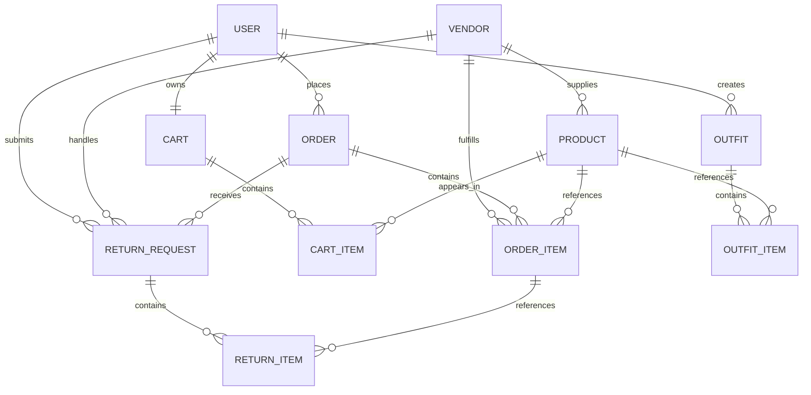

# 電商系統資料模型文件

## 1. 技術概覽

- Java Persistence：Jakarta Persistence（JPA）
- ORM：Hibernate
- 樣板程式碼：Lombok（Getter、Setter、無參數／全參數建構子）
- JSON 處理：Jackson
- 主鍵策略：`GenerationType.IDENTITY`
- 關聯載入：主要採用 `FetchType.LAZY`
- 金額欄位：大多使用 `BigDecimal(10,2)`
- 時間欄位：使用 Hibernate 的 `@CreationTimestamp`、`@UpdateTimestamp`

## 2. 實體關係圖

> `Admin` 為獨立實體，目前未與其他實體建立 JPA 關聯。

## 3. 模型一覽

| Java 類別 | 資料表 | 用途 |
|---|---|---|
| `Admin` | `admin` | 管理員登入資料 |
| `User` | `users` | 會員帳號與個人資料 |
| `Vendor` | `vendors` | 廠商帳號、狀態與合約資料 |
| `Product` | `products` | 商品資訊、庫存、價格與圖片 |
| `Cart` | `carts` | 會員購物車 |
| `CartItem` | `cart_items` | 購物車商品明細 |
| `Order` | `orders` | 訂單主檔與收件資料 |
| `OrderItem` | `order_items` | 訂單商品明細 |
| `Outfit` | `outfits` | 會員建立的穿搭組合 |
| `OutfitItem` | `outfit_items` | 穿搭中的商品與部位 |
| `ReturnRequest` | `return_requests` | 退換貨申請主檔 |
| `ReturnItem` | `return_items` | 退換貨申請明細 |
